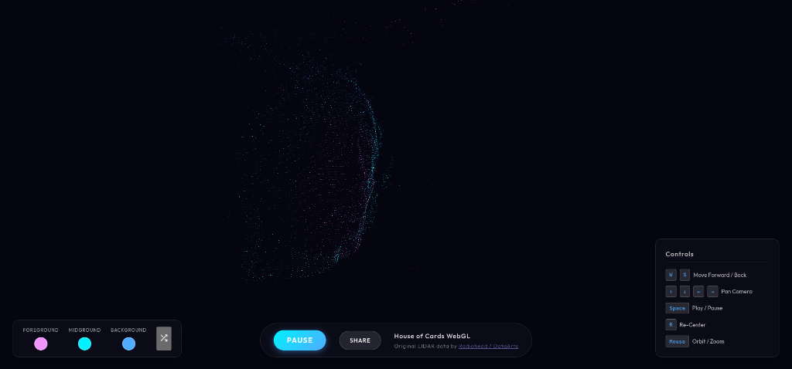

# House of Cards 3D WebGL Viewer

An interactive, real-time 3D WebGL point cloud visualization of Radiohead's "House of Cards" music video data. Built with React Three Fiber, Vite, and custom shaders.

## Overview

This project renders the raw LiDAR data captured during the filming of Radiohead's "House of Cards" music video. Because the raw dataset is over 400MB in its full, uncompressed form, it is highly recommended to run this project locally to experience the visualizer at maximum fidelity (60 FPS, millions of points) without bandwidth constraints.

## Features
- **High-Performance WebGL Shader:** Custom vertex and fragment shaders capable of rendering ~2.5 million points dynamically.
- **Audio Synchronization:** The 3D playback is strictly synchronized to the music track.
- **Depth-Based Color Grading:** Points are dynamically colored based on their Z-depth relative to the camera.
- **Interactive UI:** Features a "Randomize Vibe" button for instant color palette swaps and idle UI fade-outs for an immersive experience.
- **Snap & Share:** Take high-resolution screenshots of the point cloud natively from the browser canvas.

## Prerequisites

- [Node.js](https://nodejs.org/) (v18 or newer recommended)
- Git

## Installation & Setup

All the raw Lidar data (`.csv` files) is included in this repository inside the `data/` folder. However, before running the project, you must compile them into an optimized binary format using the provided script.

### 1. Clone the repository
```bash
git clone https://github.com/woakin/house-of-cards-webgl.git
cd house-of-cards-webgl
npm install
```

### 2. Convert Data to Binary & Chunks
We use a custom Node.js pipeline to parse the CSV files, quantize coordinate ranges, and split the dataset into parallel Cloudflare-optimized binary chunks (`frames_quantized.bin` & `public/data/chunks/`).

Run the conversion & chunking scripts:
```bash
node scripts/convert.js
node scripts/chunk_binary.js
```
*This outputs optimized quantized binary chunks (~35MB total) in `public/data/chunks/` for fast parallel web streaming.*

### 3. Run the Development Server
Once the binary chunks are generated, start the local Vite server:
```bash
npm run dev
```
Open [http://localhost:3000](http://localhost:3000) in your browser to experience the visualization!

## Controls
- **Left Click & Drag:** Orbit camera
- **Right Click & Drag:** Pan camera
- **Scroll Wheel:** Zoom in/out
- **Spacebar:** Play / Pause Audio
- **R:** Reset camera view

## License
Code is provided as-is. The original LiDAR data and audio track belong to Radiohead / [DataArts](https://github.com/dataarts/radiohead).
